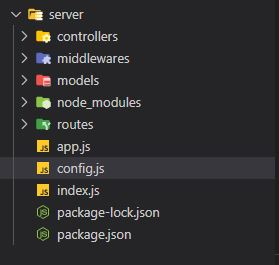

# Tareas Portfolio

|Tarea|Descripcion|Etapa|
|----------------|------------------|--------------|
| Creacion de la estructura del cliente | la idea es tomar los datos desde una base|**listo**|
|Creacion de la estructura del servidor | la idea es tomar los datos desde una base|**listo**|
|Conexion del server con **mongoDB**|------------------|**listo**|
|Sistema de rutas|es necesario un sistema de rutas con react-router-dom por ejemplo ? si rrd v6 |pendiente|
|Paquete de componentes para React|es necesario ?|pendiente|
|Estructura basica de la pagina |html y css basico , se trabajara con componentes|pendiente|
|header |header con info de contacto|pendiente|
|Componentes de proyecto|estructura general|pendiente|
|Proyecto a github|como se sube ?|**listo**|
|----------------|------------------|pendiente|
|----------------|------------------|pendiente|
|Creacion de logos|CSS O PROCREATE?|pendiente|
|----------------|------------------|pendiente|
|----------------|------------------|pendiente|

### Creacion de la estructura del cliente
- Creamos una app de react llamada **client**
- agregamos **sass** al proyecto para trabajar con css 
: **npm i sass** en client

### Creacion de la estructura del servidor
- Creamos el servidor en server con **npm init**

- agregamos datos del servidor , name ,description , etc 

- creamos varias carpetas y archivos (app.js,index.js ,config.js)

- agregamos paquete de **mongoose** para hacer peticiones a la base **npm install mongoose --save**
- agregamos **express** para configurar sistema de rutas : **npm install express**
- agregamos **connect-multiparty** : 
middleware para subir imagenes al servidor(**aun no se si debo usarlo**) .

### Conexion del server con **mongoDB**: 

- en app.js traemos **express** 
- en el index.j traemos la **app** y **mongoose** 

- traemos las constantes desde config.js y configuramos la conexion ...

- creamos el **script** para ejecutar todo instalando previamente **npm install -g nodemon** para que lea los cambios en el codigo de forma automatica , el script a agregar sera :**"start": "nodemon index.js"**

### Creacion del sistema de rutas 

- instalamos en el client : **npm install react-router-dom@6**
- en App.js importamos los componentes de rrd version 6 
- la idea va a ser rutear hacia una home y en un futuro si queremos agregar paginas vamos a expandir el array de rutas en routes.js
- creamos una Home en una carpeta de pages un LayoutBasic en una carpeta Layouts e importamos todo en routes.js para generar nuestro array de rutas

- en App.js recorremos este array routes mediante una funcion map() renderizando en un objeto Route nuestras paginas y layouts 
~~~
  <Route  key={index} 
                          path={route.path}
                          element={ <route.layout>
                                    <route.component/>
                                    </route.layout>}
                            />
~~~

- falta pagina de error404 que en estos momentos no seria necesaria 
<a href="https://www.udemy.com/course/web-personal-mern-full-stack-mongodb-express-react-node/learn/lecture/16290086#overview">Ver video</a>

    

