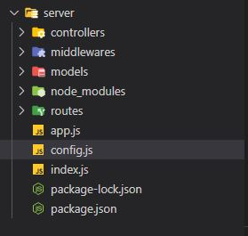
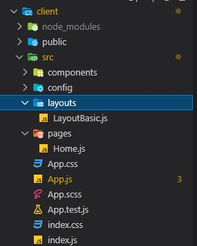

# Tareas Portfolio

|Tarea|Descripcion|Etapa|
|----------------|------------------|--------------|
| Creacion de la estructura del cliente | la idea es tomar los datos desde una base|**listo**|
|Creacion de la estructura del servidor | la idea es tomar los datos desde una base|**listo**|
|Conexion del server con **mongoDB**|------------------|**listo**|
|Sistema de rutas|es necesario un sistema de rutas con react-router-dom por ejemplo ? si rrd v6 |**listo**|
|Paquete de componentes para React|material UI |**listo**|
|Proyecto a github|como se sube ?|**listo**|
|Diagramar Layouts |vamos a hacerlo con css grid y flexbox , header y content |**listo**|
|Resolver Icons del Header|puede ser con **antd**|**listo**|
|Resolver posiciones en el layout-header-footer-content|------------------|**listo**|
|Modelos de info para la base mongoDB|------------------|**listo**|
|Funcionalidad de creacion de nuevos proyectos|Create|**listo**|
|Formulario de nuevos proyectos|------------------|**listo**|
|Renderizar imagenes de Skills en componentes|------------------|**listo**|
|Subir archivos (.md e imagenes) al servidor |------------------|**listo**|
|Obtener nombre de archivo y path de la base de datos|------------------ |**listo**|
|Subida de archivos en formulario de nuevo proyecto |-----------------|**listo**|
|Realizar subida de imagenes y validar extensiones de archivos e imagenes |------------------|**listo**|
|Visualizar imagenes de proyectos en el front |------------------|**listo**|
|Configurar descarga de archivos mediante vista desde el server mediante vista o visualizar archivo .md en linea ||**listo**|
|Vincular archivos subidos con el proyecto  |------------------|**listo**|
|Creacion de usuario administrador |------------------|**listo**|
|Creacion formulario de login para usuario administrador |------------------|**listo**|
|Login con jwt y manejo de tokens|------------------|**listo**|
|Creacion de middleware para proteger endpoints con login|------------------|**listo**|
|Formulario de update para proyectos ya existentes|------------------|**listo**|
|Funcionalidad de modificacion de proyectos|Update|**listo**|
|Funcionalidad de borrado de proyectos|Delete|**listo**|
|Validar formulario de nuevos proyectos|------------------|**listo**|
|**Apartado visual y algunas funcionalidades** |
|Pagina de Inicio|------------------|**listo**|
|Header|Agregar links a los iconos |**listo**|
|Solucionar aparicion de icon Login en header de inicio|------------------|pendiente|
|CSS de componentes de Proyecto|------------------|pendiente|
|CSS de formularios|------------------|pendiente|
|Personalizar elementos de notificacion mediante hooks para acciones de administrador |https://coder-solution-es.com/solution-es-blog/1164768|pendiente|
|Colores y fuentes |CSS|pendiente|
|CSS de formularios|------------------|pendiente|
|Hacer elementos responsive|------------------|pendiente|
|Dark-mode button en el header|------------------|pendiente|

### Creacion de la estructura del cliente
- Creamos una app de react llamada **client**
- agregamos **sass** al proyecto para trabajar con css 
: **npm i sass** en client

### Creacion de la estructura del servidor
- Creamos el servidor en server con **npm init**

- agregamos datos del servidor , name ,description , etc 

- creamos varias carpetas y archivos (app.js,index.js ,config.js)

- agregamos paquete de **mongoose** para hacer peticiones a la base **npm install mongoose --save**
- agregamos **express** para configurar sistema de rutas : **npm install express**
- agregamos **connect-multiparty** : 
middleware para subir imagenes al servidor(**aun no se si debo usarlo**) .

### Conexion del server con **mongoDB**: 

- en app.js traemos **express** 
- en el index.j traemos la **app** y **mongoose** 

- traemos las constantes desde config.js y configuramos la conexion ...

- creamos el **script** para ejecutar todo instalando previamente **npm install -g nodemon** para que lea los cambios en el codigo de forma automatica , el script a agregar sera :**"start": "nodemon index.js"**

### Creacion del sistema de rutas 

- instalamos en el client : **npm install react-router-dom@6**
- en App.js importamos los componentes de rrd version 6 
- la idea va a ser rutear hacia una home y en un futuro si queremos agregar paginas vamos a expandir el array de rutas en routes.js
- creamos una Home en una carpeta de pages un LayoutBasic en una carpeta Layouts e importamos todo en routes.js para generar nuestro array de rutas

- en App.js recorremos este array routes mediante una funcion map() renderizando en un objeto Route nuestras paginas y layouts 
~~~
  <Route  key={index} 
                          path={route.path}
                          element={ <route.layout>
                                    <route.component/>
                                    </route.layout>}
                            />
~~~

- falta pagina de error404 que en estos momentos no seria necesaria 
<a href="https://www.udemy.com/course/web-personal-mern-full-stack-mongodb-express-react-node/learn/lecture/16290086#overview">Ver video</a>

- Asi viene la estructura de nuestro client : 

### Libreria de componentes 

- instalamos material UI : **npm install @mui/material @emotion/react @emotion/styled** en el client 

### Diagramar Layouts 

#### Header : 

Diagrama con un header fijo compuesto de dos divs colocados a izquierda y derecha del contenedor principal ,usamos IconButton de material UI (**from '@mui/material'**) y una biblioteca de iconos (**from '@mui/icons-material**)

#### Content :

En este caso nuestro content del LayoutBasic sera la pagina Home (por ahora tenemos una sola pagina)

Necesitamos : 

- limitar el area del content : lo hacenos en el scss del layout mediante 

~~~
.content{
    display: flex;
    flex-direction: column;
    align-items:center;
    margin: 30px 50px 0px 50px; 
}
~~~

con esto tendremos nuestras cajas de proyecto centradas y los margenes adecuados 

#### Footer :

la idea es que el footer se vea al final del scroll en el pie de pagina

 ### Modelos de proyectos para la base mongoDB 

Necesitamos un modelo para el Project a cargar en la base de datos y luego en los componentes Projecto.js 
~~~
const ProjectSchema = Schema({
    title : String,
    image: String,
    link : String,
    skills: [{
        type: String
    }],
    description: String,
    
})
~~~
### Formulario de nuevos proyectos 
- Creamos un formulario para ingresar proyectos (en un futuro protegido por login) .
- El formulario esta compuesto de dos inputs de tipo text para el title y el link del proyecto , un campo de tipo textarea para la descripcion del proyecto , y un conjunto de casillas tipo checkbox con las distintas habilidades implementadas en la realizacion del proyecto .

- Los value de las checkbox se guardan en el arreglo **skills** de nuestro modelo de project

### Funcionalidad de creacion de nuevos proyectos

- Creamos el endpoint para crear nuevos proyectos :
en el controlador(server) de project 

~~~
function newProject(request,response){
~~~

- En client -> api -> project :

~~~
function newProjectApi(){
~~~

 utilizamos esta funcion en la funcion registerForm del componente NewProjectForm.

- Creamos el endpoint para crear traer proyectos de la base  :
en el controlador(server) de project 

~~~
function getProject(request,response){
~~~

- En client -> api -> project :

~~~
function getProjectApi(){
~~~

- esta funcion sera utilizada en un **useEffect** de la Home para traernos de la base la lista de proyectos y renderizar asi los components **Proyecto** con los datos de la lista 

~~~
const [projectsList,setProjectsList] = useState([]);

useEffect(() => {
    getProyectsApi().then(response => {
      setProjectsList(response)
    })
}, [])

const arrayProjects = projectsList.projects;
~~~
- extraemos el array de proyectos y renderizamos mediante una funcion **.map( )** con los componentes **Proyecto** y los datos de los elementos del array pasados por **props** a dichos componentes.

### Renderizar imagenes de skills 

<a href='https://www.youtube.com/watch?v=bVf3DqkiPw8'>https://www.youtube.com/watch?v=bVf3DqkiPw8</a>

- Las imagenes van alojadas en **client -> assets** y estan en formato **.svg**.

- Los componentes skill contienen una imagen y un titulo y se renderizan en una SkillsList dentro del componente Proyecto .

- Nos valemos de **require.context()** para acceder al directorio de skill-images sin tener que importar cada imagen en el compenente skill 

<a href='https://webpack.js.org/guides/dependency-management/#requirecontext'>https://webpack.js.org/guides/dependency-management/#requirecontext</a>

- Repositorio de logos .svg : 

<a href='https://worldvectorlogo.com/'>https://worldvectorlogo.com/</a>

### Subir archivos (.md e imagenes) al servidor

- Usamos **multer** para realizar el manejo de archivos .
- Estos iran alojados en la carpeta uploads de server .

- Debemos configurar multer para poder elegir varios archivos , una vez elegidos estos archivos debemos rellaenar el array files de project con el nombre de estos archivos . 

### Vincular cada proyecto con archivos guardados 

- Cada archivo de apuntes puede tener varios proyectos relacionados o tambien podemos decir que cada proyecto tiene varios archivos relacionados . 

- Idea 1: podemos agregar a cada archivo subido un array de numbers correspondiente a los id de cada proyecto y realizar un renderizado condicional recorriendo dicho array . Si el "id_project" es igual alguno de los elementos de dicho array entonces renderizamos en el componente Proyecto un elemento con la imagen en miniatura del archivo .md y un link para descargar el archivo .
- **Idea 2 : podemos usar el fileName del archivo , cada project tendra un array **files** con los fileName a renderizar** .

### Subida de archivos en formulario de nuevo proyecto

- Una vez que clickeado "Nuevo Proyecto" los archivos seleccionados deben guardarse en las carpetas del servidor correspondientes , esta tarea se ejecuta utilizando **multer** por medio de la funcion **uploadFile** del controlador fileProject pasandole el midlleware uploader

~~~
api.post('/upload-file',uploader.single('file'),FileProjectController.uploadFile);
~~~
- **en el server** 

 - **uploadFile** realiza un registro en la base de los archivos guardados con nombre del archivo y path 

- **uploader.single('file')** establece un path de destino de los archivos guardados y realiza el guardado en la carpeta uploads/project-files 

- **en el client**

- **uploadFileApi(file)** recibe como parametro un archivo , lo coloca en un **FormData** y realiza el llamado a la funcion del server por medio de la url y el metodo POST con el formData en el body 

- finalmente recorremos el array **selectedFiles** con uploadFileApi

### Realizar subida de imagenes y validar extensiones de archivos e imagenes

- Se validaran extensiones de archivos en las funciones handleFiles y handleImages en el componente NewProjectForm y antes de realizar el guardado de archivos en el servidor mediante la constante de configuarcion storage de multer .

- En **storage** modificamos la constante agregando una direccion de guardado condicional dependiendo si tenemos una imagen o un archivo de texto .

- En el controlador de fileProject agregamos la funcion uploadImage para registrar los archivos subidos al servidor y la utilizamos junto con el middleware multer para realizar la subida de archivos . 

- En el front creamos la funcion uploadImageApi para conectar con estas funcionalidades . 

### Visualizar archivos/imagenes en el front 

- En el caso de la imagen del proyecto la misma se aloja en el server y es traida por getImageApi en el componente ImageCard. 

- Vamos a leer los datos com una url , en ImageCard :
~~~
  //estado para guardar la URL generada 
    const [fileDataURL, setFileDataURL] = useState(null);
~~~

y nos valdremos de getImageApi() para traer la imagen en el server en formato blob()

<a href='https://runebook.dev/es/docs/dom/response/blob'>https://runebook.dev/es/docs/dom/response/blob</a>

<a href='https://runebook.dev/es/docs/dom/blob'>https://runebook.dev/es/docs/dom/blob</a>

<a href='https://morioh.com/p/1d57d600e537'>https://morioh.com/p/1d57d600e537</a>
  
- **Creamos la funcion readFile(file)**: 

~~~
 // funcion para leer el archivo de imagen 
   function readImage(file) {
  // Check if the file is an image.
  // if (file.type && !file.type.startsWith('image/')) {
  //   console.log('File is not an image.', file.type, file);
  //   return;
  // }

  const reader = new FileReader();

  reader.addEventListener('load', (event) => {
    setFileDataURL(event.target.result)
    //img.src = event.target.result;
    
  });
  reader.readAsDataURL(file);
  }
~~~

- No necesitamos chequear la extension de los archivos ya que desde el formulario de creacion esta ya es validada y estamos seguros de que es una imagen lo buscado. 

- En esta funcion se crea un nuevo FileReader y se le agrega un escuchador de eventos que asigna al estado fileDataURL el result de dicho evento .

- Luego asignamos al FileReader la lectura del blob() como 'DataURL'

- **Asincronia en la lectura** : 

- Finalmente simulamos un funcion asincrona mediante un setTimeOut para utilizar readImage : 

~~~
 const readWithDelay =  () => {
  getImageApi(image).then(response => {
    setTimeout(
        readImage(response)
    ,50);

   });
}
~~~

- **readImage recibira como parametro el resultado de la promesa getImageApi()**

### Configurar descarga de archivos mediante vista desde el server  y/o visualizar archivo .md en linea

 - Renderizamos un icono por cada archivo en la fileList de archivos .md en el componente FileCard

- En el controlador de fileProject tenemos getFile(name) que nos devuelve el archivo alojado en :  /uploads/project-files en formato blob.

~~~
//funcion para retornar archivos al recibir por params el nombre del mismo 
function getFile(request,response){

    const {name} = request.params;
    
    const filePath = "./../uploads/project-files/" + name ; 

    //generamos una ruta absoluta 
    const pathFile = path.join(__dirname,filePath);

    //comprobamos si la imagen existe y en caso que podamos leeerla la retornamos 
    if(fs.existsSync(pathFile)){
        fs.readFile(pathFile,(err,data)=>{
            if(err){
                console.log(err)
            } else {
                response.sendFile(path.resolve(pathFile))
            }
        })
    } else {
        response.status(404).send({message:"Archivo no encontrado"});
    }

}
~~~
- En el componente FileCard del cliente  : 
~~~
export default function FileCard(props) {

const {fileName} = props ;

const fileSplit = fileName.split(".");
const fileAlt = fileSplit[0];

const handleClick = () => {

    //solicitamos el archivo en formato blob desde el server
    getFileApi(fileName).then( response => {

    //creacion de la objectURL mediante el blob    
    const href = URL.createObjectURL(response);
    
    //creacion del anchior y seteo de propiedades
    const a = Object.assign(document.createElement('a'),{
        href,
        style: "display:none",
        download: `${fileName}`
    })
    //agregamos el elemento al body
    document.body.appendChild(a);

    //generamos un evento en el anchor creado
    a.click();
    //limpiamos la URL del navegador una vez echa la descarga
    URL.revokeObjectURL(href);
    //removemos la etiqueta creada
    a.remove();
    })

  };
   
  return (
    

            </img>
            <button onClick={handleClick}>
                Descargar
            </button>
        
    

  )
}
~~~

### Agregar funcionalidad de usuarios y permisos de edicion (Login con jwt y manejo de tokens)

- Creamos en el controlador de user un endpoint para crear nuevos usuarios con role de administrador . 

- Para encriptar contrasenas usaremos bcrypt : 
**npm i bcrypt**
- https://www.izertis.com/es/-/blog/encriptacion-de-password-en-nodejs-y-mongodb-bcrypt

~~~
function signUp(request,response){
   //nueva instancia del modelo User
   const user = new User();

   const { name , password , repeatPassword } = request.body ; 

   //asignamos valores uno a uno con user
   user.name= name;
   user.role= "admin";

    //creamos una estructura condicional 
    if (!password ||!repeatPassword) {  // si falla algun password 
        
        response.status(404).send({message: "Las contrasenas son obligatorias"})
    } else {

        if (password!==repeatPassword){
            response.status(404).send({message: "Las contrasenas tienen que ser iguales"})
        } else {
            //vamos a encriptar la contrasena 
            bcrypt.hash(password ,SALTS_TO_BCRYPT ,function (err , hash ) {
                    
                if (err){
                    response.status(500).send({message: "Hubo un error de encriptacion "})
                    
                } else {
                    // asignamos la contrasena al usuario 
                    user.password= hash ; 
                    // utilizamos una funcion de mongoose para guardar la contrsena en la base de datos 
                    user.save((err , userStored )=>{
                        if (err){
                            response.status(500).send({message: "Error del servidor , el usuario ya existe "})

                        } else {
                                    if (!userStored){
                                        response.status(404).send({message: "Error al crear el usuario "})

                                    } else {
                                        response.status(200).send({user:userStored})
                                            }
                                }
                                                    })
                        }
            })
        }
    }}

~~~

- Las funcionalidades de edicion de proyectos y de ingreso de nuevos proyectos estaran restringidas a estos usuarios .

- Mediante este endpoint y usando Postman ingresamos un admin en la base de datos con cotrasena.(en el futuro este endpoint estara protegido por tokens).

- Creamos el endpoint signIn para poder ingresar como admin al Portfolio. **Este endpoint devolvera los tokens correspondientes en caso de que el usuario y contrasena sean correctos.**

~~~
function signIn(request,response){
    const params = request.body ;
    
    const name= params.name;
    const password= params.password;

    //funcionalidad de mongoose para buscar en la base 
    User.findOne({name} , (err, userStored) => {

        if(err){
            response.status(500).send({message:"Error del servidor."})
        } else {
            if (!userStored){
                response.status(404).send({message:"Usuario no encontrado."})
            } else {

                // comparacion de contrasenas con bcrypt la ingresada con la encriptada
                //el valor de la contrasena encriptada es userStored,password 
                bcrypt.compare(password,userStored.password , (err,check)=>{

                    if (err){
                        response.status(500).send({message:"Error del servidor."})

                    } else if (!check) {
                       
                        response.status(404).send({message:"La contrasena es incorrecta."})

                    } else { 
 
                            response.status(200).send({
                                accessToken : jwt.createAccessToken(userStored),
                                refreshToken : jwt.createRefreshToken(userStored)
                                                })
                            }
                }) 
            }
        }
    })
}
~~~

- En el client creamos el componente LoginForm para ingresar como administrador , el mismo incluira un boton para ingresar como invitado 

- Luego creamos signInApi() para realizar el login desde el client 

~~~
export function signInApi(dataUser) {

    const url = `${basePath}/${apiVersion}/sign-in`;

    const params = {
        method: 'POST',                                            
        body: JSON.stringify(dataUser),
        headers: {
            "Content-type":"application/json",                        
        }

    }

    // retornamos un fetch() o sea una peticion asincrona
    return fetch(url,params)

    .then(response => {
       return response.json()
            }).then(result =>{
                return result; 
                })
                    .catch(err => {
                        return err.message
                    })

}
~~~

- Y usamos signInApi en la funcion login de nuestro componente LoginForm para **recibir el accessToken y el refreshToken como respuesta y guardarlos en el localStorage de la sesion**.

- **Creamos en client -> src -> api -> auth.js 
para decodificar los tokens recibidos** : 

- La funcion **willExpireToken(token)** recibe un token y devuelve true o false si este esta caducado o sigue vigente respectivamente. 

- La funcion **logout()** remueve los tokens del localStorage 

- Las funciones **getAccessTokenApi()** y **getRefreshTokenApi()** devuelven los tokens access y refresh si estos estan vigentes en caso contrario devuelven **null**

- La funcion **refreshAccessTokenApi(refreshToken)** refresca el token del lado del cliente 

- **Creamos en **server-> controllers-> auth.js** el endpoint para refreshAccessToken** :

- **willExpireToken(token)** verifica en el servidor si el token a expirado (devuleve true en este caso).

- **refreshAccessToken** recibe el refreshToken , verifica si esta vigente y en caso de que lo este extrae el id del usuario del mismo y realiza una busqueda en la base con el id generando un nuevo accessToken con el usuario resultante ,finalmente devuelve el refreshToken y el accessToken.

- **Creamos las rutas correspondientes en el server**

### Manejo del contexto :

- Creamos el hook **useAuth** el cual nos devolvera el contexto o datos del contexto 

- Creamos la carpeta de **providers** con un archivo **AuthProvider.js** donde **crearemos el contexto** .

- La idea principal es crear un **contexto** en el cual se envolvera toda nuestra app para saber si estamos ante administradores o no .

- Envolvemos toda nuestra app en el contexto 
~~~
import AuthProvider from "./providers/AuthProvider";

function App() {
  return (
    <AuthProvider>
      <Router>
          <Routes>
            {routes.map((route,index) => (
                  <Route  key={index} 
                          path={route.path}
                          element={ <route.layout>
                                    <route.component/>
                                    </route.layout>}
                            />
            ))}
          </Routes>
      </Router>
    </AuthProvider>
  );
}
~~~

- Usamos admin y isLoading en los distintos componentes de la aplicacion , por ejemplo para bloquear la pagina de ingrso de nuevos proyectos a usuarios no logueados . 

### Formulario de update para proyectos ya existentes y funcionalidades de modificacion en la base (**UPDATE**)

- Creamos el componente Modal el cual recibira como children al componente UpdateProjectForm y cambiara su visibilidad en funcion del estado **isVisibleModal**, este estado esta creado en la Home y es pasado por props tanto al componente Modal como al componente Proyecto para su modificacion. 

- Otro elemento a considerar es que el componente UpdateProjectForm necesita la informacion del proyecto a modificar , para eso creamos un estado en la Home que recibe los datos del proyecto **dataProjectModal** , este estado es pasado por props a Proyecto y a UpdateProjectForm para su modificacion .

- En el server creamos updateProject para realizar la modificacion .En el controlador de proyectos : 

~~~
//funcion para modificar proyectos 
function updateProject(request,response){

    //recibimos la informacion por el body de la peticion 
    const projectData = request.body;
    //recibimos el id por los params 
    const params = request.params

    Project.findByIdAndUpdate({_id:params.id},projectData,(error,projectUpdate)=>{
        if (error){
            response.status(500).send({message:'Error en el servidor.'})
        } else {
            if (!projectUpdate){
                response.status(404).send({message:'Proyecto no encontrado.'})
            } else {
                response.status(200).send({message:'Proyecto actualizado correctamente.'})
            }
        }
    })
}
~~~

- Esta funcion recibe los datos a modificar en el body y el id del proyecto en los params 

- Creamos el endpoint protegido por token en las routes: 
~~~
api.put('/update-project/:id',[md_auth.ensureAuth],ProjectController.updateProject);
~~~

- En las api del client (api/project.js) : 

~~~
export function updateProjectApi(projectData,projectId,token){

    const url = `${basePath}/${apiVersion}/update-project/${projectId}`

    const params ={
        method: 'PUT',
        body: JSON.stringify(projectData),
        headers: {
            "Content-type":"application/json",
            "Authorization": token
        }
    };

        // retornamos un fetch() o sea una peticion asincrona
        return fetch (url ,params)
        .then (response => {
            return response.json()
        })
        .then (result => {
            return result ; 
        })  // por si tiene error , devuelve el mensaje de error del endpoint 
        .catch(err=> {
            return err.message
        }   
            )
}
~~~

- El formulario de modificacion de proyecto es casi identico al de ingresar nuevos proyectos salvo por la funcion updateProject (client/components/UpdateProjectForm) :

~~~
    //funcion para modificar proyecto 
    const updateProject = event => {

    event.preventDefault();
    //obtenemos el token 
    const token = getAccessTokenApi();

    //limpiamos valores de skills , files de los array 
    projectData.skills = [];
    projectData.files = []

   
    //guardamos los skills en el array de inputs 
     let checkboxes = document.querySelectorAll('input[name="checkbox"]:checked');
     checkboxes.forEach((checkbox) => {

         if (!projectData.skills.includes(checkbox.value)){
            projectData.skills.push(checkbox.value);
         }
             });

    //recolectamos nombres de los archivos para guardar en la base 
    selectedFiles.forEach((file)=>{
        projectData.files.push(file.name);
    });
    //recolectamos nombres de las imagenes para guardar en la base 
    //selectedImages.forEach((image)=>{
        projectData.image = (selectedImage.name);
    //});

    updateProjectApi(projectData,dataProjectModal.id,token);

    //guardar archivos en el servidor 
    selectedFiles.forEach((file) => {
        uploadFileApi(file); 
    });

    //guardar imagenes en el servidor 
    uploadImageApi(selectedImage)

    setIsVisibleModal(false)

    console.log(projectData);
    console.log(dataProjectModal.id)
    }
~~~

- Esta funcion realiza el update del proyecto mediante updateProjectApi y cierra el modal , faltaria deplegar un aviso de "Proyecto ${name} modificado "

### Funcionalidad de borrado de proyectos (**DELETE**)

- En el server creamos deleteProject para realizar el borrado en la base  .En el controlador de proyectos : 

~~~
//funcion para borrar proyectos 
 function deleteProject(request,response){

    //recibimos el id por los params 
    const params = request.params

    Project.findByIdAndRemove({_id:params.id},(error,projectDeleted)=>{

        if (error) {
            response.status(500).send({message:'Error en el servidor'})
        } else {
            if (!projectDeleted){
                response.status(404).send({message: 'Proyecto no encontrado'})
            } else {
                response.status(200).send({message:'Proyecto borrado correctamente'})
            }
        }

    })
 }
~~~
- En las routes del server (routes/project.js): 

~~~
api.delete('/delete-project/:id',[md_auth.ensureAuth],ProjectController.deleteProject);
~~~

- En el cliente creamos deleteProjectApi :

~~~
export function deleteProjectApi(projectId,token){

    const url = `${basePath}/${apiVersion}/delete-project/${projectId}`

    const params = {
        method :'DELETE',
        headers : {
            "Content-type":"application/json",
            "Authorization": token
        }
    }

         // retornamos un fetch() o sea una peticion asincrona
         return fetch (url ,params)
         .then (response => {
             return response.json()
         })
         .then (result => {
             return result ; 
         })  // por si tiene error , devuelve el mensaje de error del endpoint 
         .catch(err=> {
             return err.message
         }   
             )
}
~~~

- Y utilizamos esta funcionalidad en el componente de Proyecto :

~~~
  const deleteProject = () => {
    const token = getAccessTokenApi();
    deleteProjectApi(id,token);
  }
~~~

## Apartado visual y algunas funcionalidades 

### Header 

- Trabajamos en el header agregando links para linkedin, github y otro para realizar el login o el deslogueo del administrador 

- Unidades em y rem 

- 

- problemas con localhost message :

- crbug/1173575, non-JS module files deprecated.

- To Solve VM305:5551 crbug/1173575, non-JS module files deprecated Error Just delete the launch.json file and it worked for me

    

